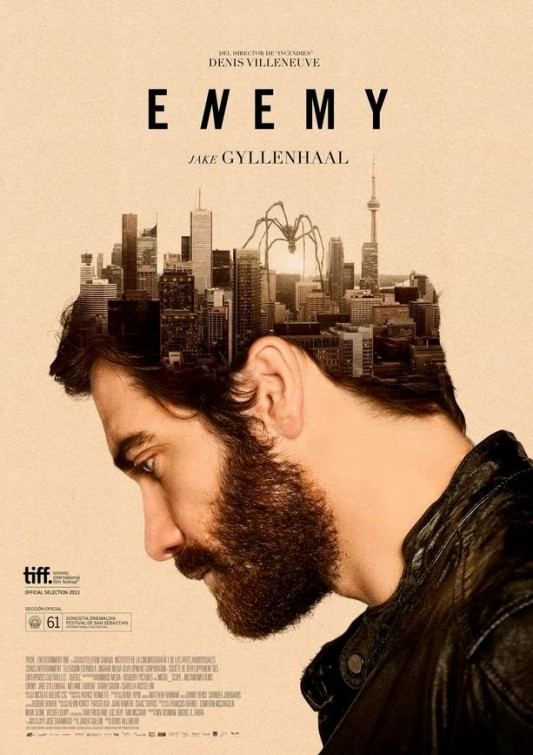
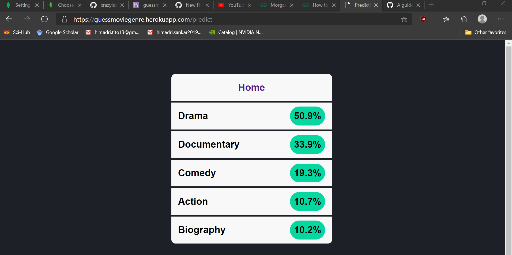

# Predicting Movie genre from Poster

The application consists of a simple convolutional neural network trained to score each applicable genre to a movie based on the poster it is provided. The app is hosted in the
Heroku platform. I am still trying to train the model to achieve greater accuracy on the predictions. The main objective was to host an app using Flask.

[Online App](https://guessmoviegenre.herokuapp.com/) <- The heroku hosted page. When you enter, you will see a simple UI with the choice to upload a file, like this:

Select a file and upload it. You will be directed to the next page for the results, showing the top 5 genre applicable for the movie from its poster.

